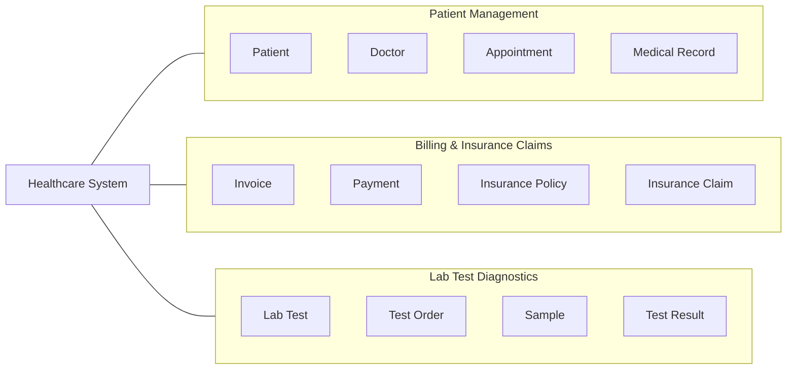

# Domain Context Mapping

## Context Diagram



## Primary Entities

### Patient Management

* Patient
* Doctor
* Appointment
* Medical Record

### Billing & Insurance Claims

* Invoice
* Payment
* Insurance Policy
* Insurance Claim

### Lab Test Diagnostics

* Lab Test
* Test Order
* Sample
* Test Result

```

```
