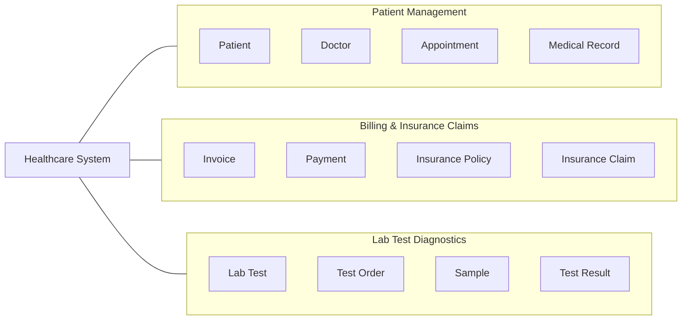

# Domain Context Mapping

## Context Diagram



## Primary Entities

### Patient Management

* Patient
* Doctor
* Appointment
* Medical Record

### Billing & Insurance Claims

* Invoice
* Payment
* Insurance Policy
* Insurance Claim

### Lab Test Diagnostics

* Lab Test
* Test Order
* Sample
* Test Result

```

**But one important thing:** don't make the diagram different *just to hide copying*. The content still needs to represent the assignment accurately. This version does that: it shows the healthcare system divided into the **three bounded contexts**, and your entities are clearly inside each context.

Also, **don't copy the girl's exact entity list unless those entities genuinely fit your analysis**. Ours are reasonable domain entities based on the three contexts given in your assignment.
```
