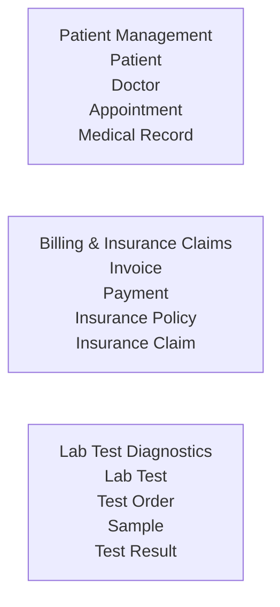

# Domain Context Mapping

## 1. Patient Management

**Bounded Context:** Patient Management

**Primary Entities:**

* Patient
* Doctor
* Appointment
* Medical Record

## 2. Billing & Insurance Claims

**Bounded Context:** Billing & Insurance Claims

**Primary Entities:**

* Invoice
* Payment
* Insurance Policy
* Insurance Claim

## 3. Lab Test Diagnostics

**Bounded Context:** Lab Test Diagnostics

**Primary Entities:**

* Lab Test
* Test Order
* Sample
* Test Result

## Context Diagram

